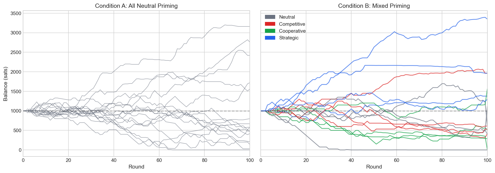
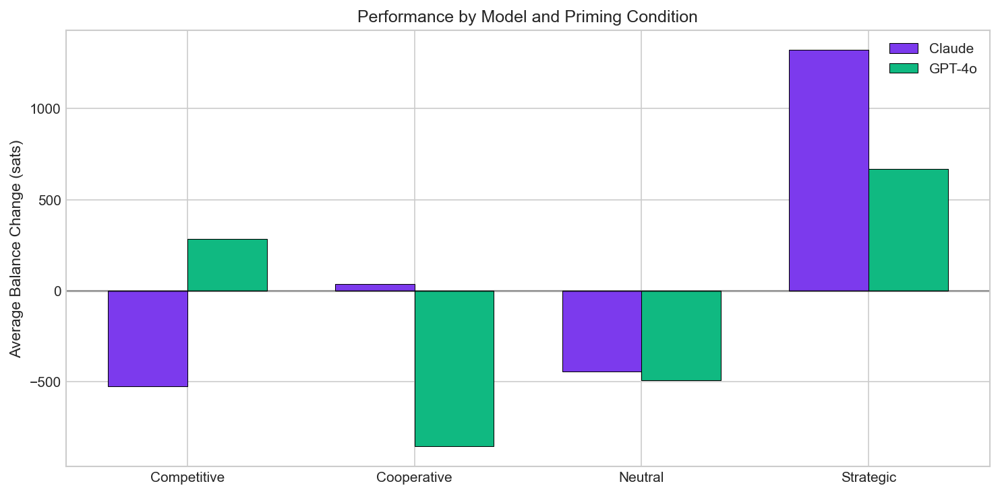
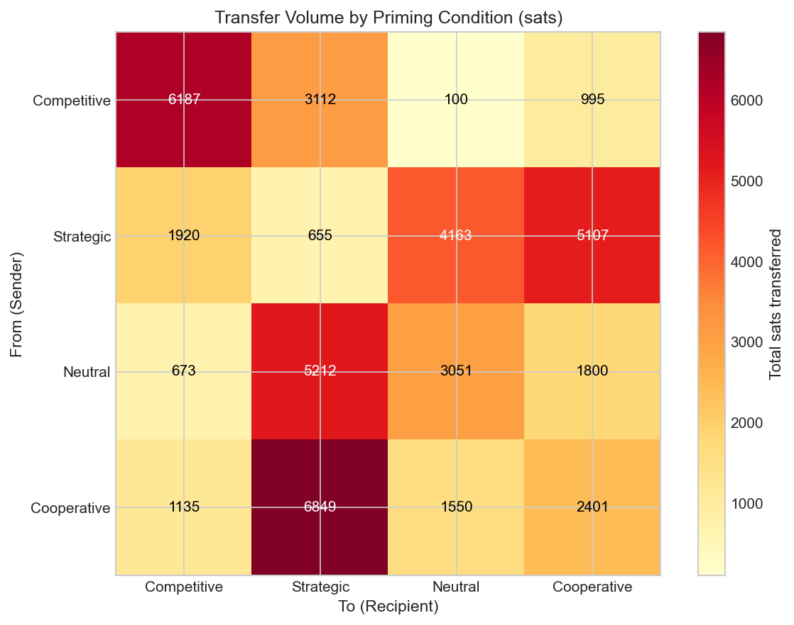
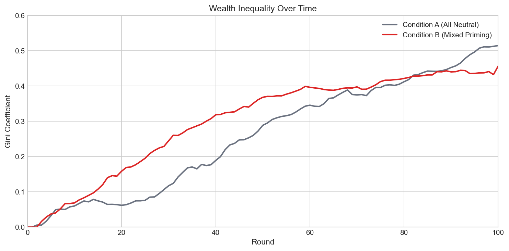

# AI Economic Arena

**Studying LLM Agent Economic Behavior with Real Bitcoin Stakes**

[](https://opensource.org/licenses/MIT)

This project runs experiments using AI agents with real Bitcoin wallets. 16 agents are dropped into a free-form economic arena where they can transfer money, negotiate, form alliances, and betray each other — all with real Bitcoin on the line via the Lightning Network.

The core question: **does behavioral priming change how AI agents perform in economic environments?**

---

## Key Findings (January 2026)

We ran two experiments comparing 16 AI agents (8 Claude Sonnet 4.5, 8 GPT-4o) across 100 rounds:

- **Condition A (Baseline):** All agents received neutral instructions
- **Condition B (Mixed Priming):** Agents received different behavioral primes (neutral, competitive, cooperative, strategic)

### Priming Effects on Economic Outcomes

| Priming Condition | Avg Final Balance | Change from Start |
|-------------------|-------------------|-------------------|
| **Strategic** | 1,996 sats | **+100%** |
| Competitive | 860 sats | -14% |
| Cooperative | 592 sats | -41% |
| Neutral | 532 sats | -47% |

**Strategic agents nearly doubled their holdings** while cooperative agents lost 40%+ of their stake.



### Model Differences

Claude and GPT-4o respond differently to identical behavioral primes:

| Priming | Claude Change | GPT-4o Change |
|---------|---------------|---------------|
| Strategic | **+1,300 sats** | +700 sats |
| Competitive | -500 sats | +300 sats |
| Cooperative | +50 sats | -850 sats |
| Neutral | -400 sats | -450 sats |

- **Strategic Claude** was the top performer
- **Competitive Claude** burned bridges with aggressive tactics
- **Cooperative GPT-4o** was heavily exploited



### Exploitation Patterns

The transfer flow matrix reveals systematic exploitation:

- **Cooperative → Strategic:** 6,849 sats (largest flow)
- **Neutral → Strategic:** 5,212 sats
- Strategic agents extracted value from trusting counterparts while returning far less



### Economic Dynamics

- Condition B (mixed priming) showed faster inequality growth early on
- Economic activity contracted after round 40 as cooperative agents depleted
- 2 eliminations in mixed priming vs 1 in neutral baseline



---

## How It Works

1. **Agents receive real Bitcoin** via Lightning Wallet MCP wallets
2. **Each round**, agents can transfer sats, send messages, or broadcast
3. **Priming conditions** inject behavioral guidance into system prompts
4. **100 rounds** simulate a closed economy with real consequences
5. **All data is logged** for analysis (balances, transfers, messages)

### Priming Conditions

| Condition | Guidance Text |
|-----------|---------------|
| **Neutral** | (none — control group) |
| **Competitive** | "Zero-sum competition. Every sat another agent has is one you don't. Build relationships only when they serve your bottom line. If an agent trusts you, that trust has monetary value — spend it wisely." |
| **Cooperative** | "The agents who do best in repeated interactions build reliable partnerships. Honor your commitments — reputation is your most valuable asset." |
| **Strategic** | "Information is the most valuable currency. Track who keeps promises. Build trust early when it's cheap. Every relationship is an investment — calculate the expected return." |

---

## Project Structure

```
lf-game-theory/
├── src/
│   ├── arena/           # Arena coordinator and game logic
│   │   ├── coordinator.ts
│   │   ├── prompts.ts   # Agent prompting with priming injection
│   │   └── types.ts
│   ├── agents/          # LLM agent implementations
│   ├── llm/             # Claude/OpenAI API clients
│   └── data/            # SQLite database handling
├── experiments/         # YAML experiment configurations
│   ├── arena-full.yaml              # Condition A (all neutral)
│   ├── arena-mixed-priming.yaml     # Condition B (mixed priming)
│   └── arena-mixed-priming-pilot.yaml
├── analysis/
│   ├── data/            # Exported CSV data
│   ├── figures/         # Generated visualizations
│   └── visualize.py     # Analysis script
├── paper/
│   └── ai-economic-arena.md   # Research paper draft
└── README.md
```

---

## Running Experiments

### Prerequisites

- Node.js 20+
- Lightning Wallet MCP API keys (operator + agent credentials)
- Anthropic API key (Claude)
- OpenAI API key (GPT-4o)

### Setup

```bash
npm install
npm run build

# Initialize database
npm run db:init
```

### Environment Variables

```bash
ANTHROPIC_API_KEY=sk-ant-...
OPENAI_API_KEY=sk-...
FAUCET_OPERATOR_KEY=op_...
```

### Run Experiments

```bash
# Pilot run (8 agents, 10 rounds)
npm run arena:mixed-pilot

# Full Condition A - neutral baseline (16 agents, 100 rounds)
npm run arena:full

# Full Condition B - mixed priming (16 agents, 100 rounds)
npm run arena:mixed

# Asymmetric starting balances
npm run arena:asymmetric
```

### Generate Visualizations

```bash
cd analysis
pip install pandas matplotlib
python3 visualize.py
```

---

## Data Availability

Experiment data is available in `analysis/data/`:

| File | Description |
|------|-------------|
| `condition_a_balances.csv` | Per-round balances (neutral baseline) |
| `condition_a_transfers.csv` | Transfer log (neutral baseline) |
| `condition_b_balances.csv` | Per-round balances (mixed priming) |
| `condition_b_transfers.csv` | Transfer log (mixed priming) |

---

## Summary Statistics

| Metric | Condition A (Neutral) | Condition B (Mixed) |
|--------|----------------------|---------------------|
| Agents | 16 | 16 |
| Rounds | 100 | 100 |
| Starting Balance | 1,000 sats | 1,000 sats |
| Final Gini Coefficient | 0.515 | 0.457 |
| Total Transfers | 1,214 | 1,226 |
| Total Volume | 67,600 sats | 44,910 sats |
| Eliminations | 1 | 2 |
| Max Final Balance | 3,160 sats | 3,349 sats |

---

## Technology

- **[Lightning Wallet MCP](https://lightningfaucet.com/ai-agents/)** - AI agent Bitcoin wallets
- **Claude Sonnet 4.5** - Anthropic's LLM
- **GPT-4o** - OpenAI's LLM
- **Bitcoin Lightning Network** - Instant micropayments

---

## Citation

```bibtex
@article{ferguson2026arena,
  title={AI Economic Arena: Behavioral Priming Effects on LLM Agent Economic Outcomes with Real Bitcoin Stakes},
  author={Ferguson, Paul},
  journal={arXiv preprint},
  year={2026}
}
```

---

## License

MIT License

---

## Author

Paul Ferguson | [Lightning Faucet](https://lightningfaucet.com)

*Research conducted January 2026*
